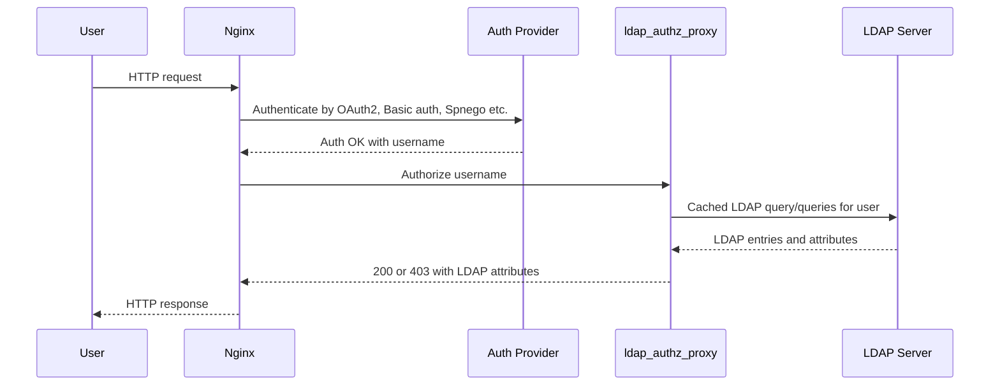
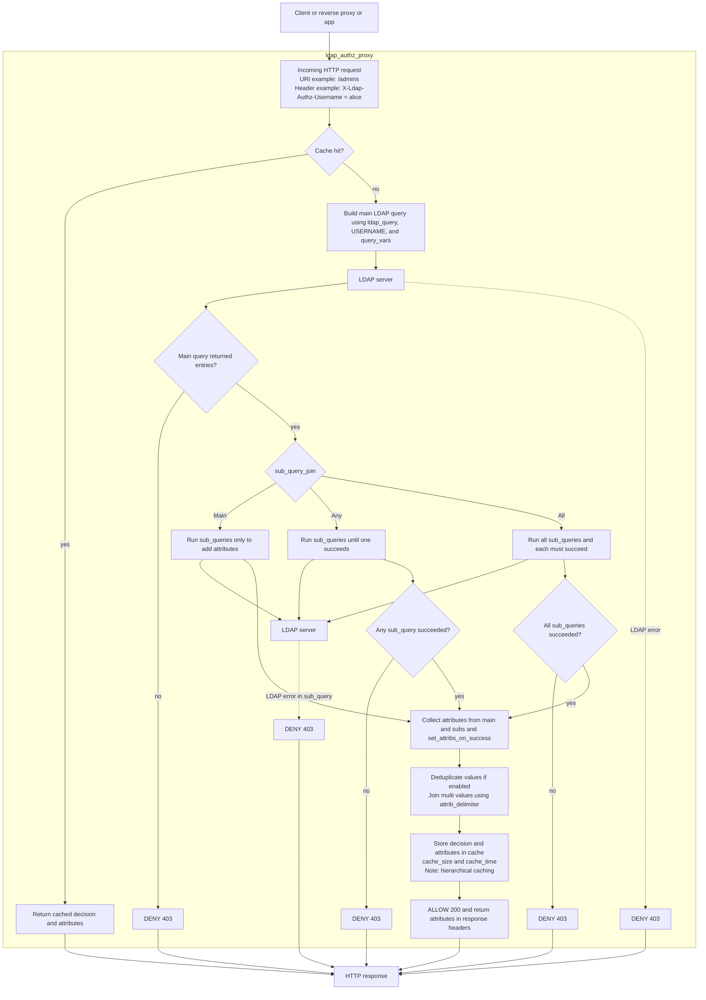

# ldap_authz_proxy - LDAP authorization proxy for pre-authenticated HTTP users

[](https://github.com/elonen/ldap_authz_proxy/actions/workflows/docker-test.yml)
[]()

- Test your HTTP (e.g. Nginx) users' access privileges against LDAP/Active Directory.
- Optionally, pass LDAP user attributes to your HTTP backend app in headers.

`ldap_authz_proxy` is a small local HTTP daemon that reads usernames from request headers
and performs configured LDAP queries with them, returning status 200 if query
succeeded, or 403 if it failed. It's designed for Nginx `auth_request`, and other
HTTP auth proxy mechanisms.

Once a user has been authenticated by some other means (OIDC, Kerberos, Basic auth, Token, ...),
this daemon can be used to **authorize** them to access some URL.

If one LDAP/Active Directory query is not enough, the program can perform sub-queries to
allow extra auth conditions, or to fetch more attributes (e.g. group memberships).
Results are cached for a configurable time.



For an overview on what happens internally, see flowchart [Detailed request flowchart](#detailed-request-flowchart)

## Configuration

Configuration file format:

```ini
[default]
; Which HTTP header to read %USERNAME% from
username_http_header = "X-Ldap-Authz-Username"

; Example LDAP server configuration. This is for Active Directory,
; and makes a recursive membership query to given group.
ldap_server_url = "ldap://dc1.example.test:389"
ldap_bind_dn = "CN=service,CN=Users,DC=example,DC=test"
ldap_bind_password = "password123"
ldap_search_base = "DC=example,DC=test"
ldap_query = "(&(objectCategory=Person)(sAMAccountName=%USERNAME%)(memberOf:1.2.840.113556.1.4.1941:=CN=%MY_CUSTOM_VAR%,CN=Users,DC=example,DC=test))"
ldap_attribs = "displayName, givenName, sn, mail"

; Cache size (these are defaults)
cache_time = 30
cache_size = 512

; These specify how to handle multiple LDAP queries/results
deduplicate_attribs = true
sub_query_join = Main


[users]
; Regular expression to match against the request URI
http_path = "/users$"
; Ldap query references variable MY_CUSTOM_VAR above. Set it for this query:
query_vars = "MY_CUSTOM_VAR = ACL_Users"
; Fetch additional attributes from LDAP my performing additional queries
; if this one succeeds. See below for their definitions.
sub_queries = "is_beta_tester, is_bug_reporter, is_peer_support"


[admins]
http_path = "/admins$"
query_vars = "MY_CUSTOM_VAR = ACL_Admins"
; Fictional example: instruct backend app to show debug info for admins
set_attribs_on_success = "extraGroups = show_debug_info"


; Internal sub-queries (not matched agains URI as http_path is not defined)
; These examples set additional attributes ("extraGroups") if the user is a
; member of specified groups.

[is_peer_support]
query_vars = "MY_CUSTOM_VAR = Role_Peer_Support"
set_attribs_on_success = "extraGroups = peer_support"

[is_beta_tester]
query_vars = "MY_CUSTOM_VAR = Role_Beta_Testers"
set_attribs_on_success = "extraGroups = beta_tester"

[is_bug_reporter]
query_vars = "MY_CUSTOM_VAR = Role_Bug_Reporters"
set_attribs_on_success = "extraGroups = bug_reporter, extraGroups = show_debug_info"
; Circular references are pruned, so this nonsense won't crash - it's just useless:
sub_queries = "is_bug_reporter, users"
```

The `[default]` section contains defaults for other sections.
In other sections, `http_path` is a regular expression
that is tested against HTTP URI path from Nginx. If it matches, `ldap_query`
is executed after replacing `%USERNAME%` with the username from HTTP headers.
If the LDAP query succeeds and returns non-empty results,
the proxy returns status 200 (with attributes in response headers), otherwise 403.

If a section has empty `http_path`, it is an internal sub-query that never matches
any URIs, and can only be referenced from other sections with `sub_queries` setting.
Sub-queries can be used to allow or deny access based on additional conditions (rules
specified by `sub_query_join`), or to fetch additional attributes from LDAP.

Option `ldap_attribs` specifies a list of LDAP attributes to return to Nginx.
The result header names are prefixed with `X-Ldap-Authz-Res-`, so for
example `displayName` attribute is returned in `X-Ldap-Authz-Res-displayName`.
Attributes with multiple values are concatenated with separator specified in `attrib_delimiter`

If an LDAP query returns multiple objects, the first one is used. To see the rest,
use `--debug` option to log them.

Corresponding **Nginx** configuration block would look roughly like this -- assuming user has already been authenticated and thus `$remote_user` variable is set:

```nginx
        auth_request     /authz_admins;
        auth_request_set $display_name  $upstream_http_x_ldap_res_displayname;

        location = /authz_admins {
            internal;
            proxy_pass              http://127.0.0.1:10567/admins;
            proxy_pass_request_body off;
            proxy_set_header        Content-Length "";
            proxy_set_header        X-Ldap-Authz-Username $remote_user;
        }
```

(See more complete examples below.)

## Cache

The server uses a simple in-memory cache to avoid performing the same LDAP queries
over and over again. Cache is limited to `cache_size` entries, and
entries are removed in LRU order. Entries last for `cache_time` seconds.

One cache entry is created for each unique username, so ldap_cache_size should
be large enough to accommodate all users that might be accessing the server simultaneously.

Technically, each config section gets its own cache, so you can have different cache sizes and
retention times for different sections. If a section uses sub-queries, the cache is shared
between the main query and all sub-queries, with main query's cache size and time.

HTTP response headers contain `X-Ldap-Cached` header that is set to `1` if the response
was served from cache, and `0` if it was a fresh query.

## Building

The server is written in Rust and can be manually built with `cargo build --release`.
Resulting binary is `target/release/ldap_authz_proxy`.

If you want Debian packages instead (recommended), see below.

## Running

The recommended way to run the server is through a process manager (e.g. systemd),
but it can also be run manually like this: `ldap_authz_proxy <configfile>`. Additional
options are available (`--help`):

```
ldap_authz_proxy -- HTTP proxy server for LDAP authorization, mainly for Nginx
This program is a HTTP proxy server that checks the authorization of an
already authenticated user against an LDAP server. It can be used to return
attributes from LDAP (or user custom) to the Nginx in HTTP headers.

Usage:
  ldap_authz_proxy [options] <config_file>
  ldap_authz_proxy -t | --test [options] <config_file> <username> <uri_path>
  ldap_authz_proxy -h | --help
  ldap_authz_proxy -H | --help-config
  ldap_authz_proxy -v | --version

Required:
  <config_file>  Path to the configuration file (e.g. /etc/ldap_authz_proxy.conf)

Options:
    -b --bind=<bind>     Bind address [default: 127.0.0.1]
    -p --port=<port>     Port to listen on [default: 10567]

    -l FILE --log FILE   Log to file instead of stdout
    -j --json            Log in JSON format
    -d --debug           Enable debug logging

    --dump-config        Check configuration file, dump parsed
                         values to stdout if successful, and exit.

    -t --test            Test mode. Query LDAP for given username and URI,
                         then exit with 0 if the user is authorized (HTTP 200)
                         or with HTTP status code (e.g. 403) otherwise.

    -h --help            Show this screen.
    -H --help-config     Show help for the configuration file.
    -v --version         Show version.
```

The executable stays in foreground, which is why it's recommended to use a
process manager such as `systemd` or `supervisord`. Example
`systemd` service file is included in `debian/service`.

## Security

The server doesn't require any special privileges, and can be run as a
normal user; the example `systemd` service file runs it as `www-data`.

Configuration file contains LDAP bind password(s), so it shouldn't be
world-readable. The server itself doesn't need to be able to write
to the configuration file.

Usernames are quoted before being used in LDAP queries, so they (hopefully)
can't be used to inject arbitrary LDAP queries. It's recommended
to use a read-only LDAP bind user just in case.

LDAPS is supported (even though the test scripts use plain ldap://), and is
recommended in production.

The server doesn't handle user passwords at all - it only reads usernames from
HTTP headers and performs LDAP queries with them.

## Packaging

The server can be packaged for Debian variants with `./build-deb-in-docker.sh`
(or to build locally, `cargo install cargo-deb && cargo deb`).

To install, issue `dpkg -i ldap-authz-proxy_*.deb`, edit `/etc/ldap_authz_proxy.conf` to
your liking, and then enable the service by `systemctl enable ldap_authz_proxy.service`.

This is the recommended way to install this on Debian systems.

## Testing

Use `./run-tests.sh` to execute test suite. It requires `docker compose`
and `curl`. The script performs an end-to-end integration test with a
real Active Directory server and an Nginx reverse proxy.

It spins up necessary containers, sets up example users, and then performs
Curl HTTP requests against Nginx, comparing their HTTP response status codes
and headers to expected values.

## Nginx configuration

See `test/nginx-site.conf` for a simple example where users are authenticated
with the Basic method and then authorized with this server using _auth_request_ directive.

### Kerberos

This software was originally developed for Active Directory auth using
Nginx, so here's a complementary example on how to authenticate some API users
against AD with Kerberos (spnego-http-auth-nginx-module) and to then authorize them using
_ldap_authz_proxy_:

```nginx
server {
        listen 443 ssl;
        ssl_certificate     /etc/ssl/private/www.example.com.fullchain.pem;
        ssl_certificate_key /etc/ssl/private/www.example.com.privkey.pem;

        server_name www.example.com;


        satisfy all;    # Require two auths: auth_gss (Kerberos) for authn, and auth_request (ldap_authz_proxy) for authz

        # 1. Authn with Kerberos
        auth_gss on;
        auth_gss_keytab /etc/krb5.keytab;
        auth_gss_realm EXAMPLE.COM;
        auth_gss_force_realm on;
        auth_gss_service_name HTTP/www.example.com;

        # 2. Authz with ldap_authz_proxy
        auth_request     /authz_all;
        auth_request_set $display_name  $upstream_http_x_ldap_res_displayname;
        auth_request_set $extra_groups  $upstream_http_x_ldap_res_extragroups;  # See example .INI

        # (internal endpoint used in step 2. above)
        location = /authz_all {
            internal;
            proxy_pass              http://127.0.0.1:10567/users;  # ldap_authz_proxy daemon
            proxy_pass_request_body off;
            proxy_set_header        Content-Length "";
            proxy_set_header        X-Ldap-Authz-Username $remote_user;  # $remote_user is set by auth_gss
        }

        # The (fictional) web app
        location /api {
                proxy_pass http://127.0.0.1:8095/api;

                # Pass authenticated username to backend
                proxy_set_header X-Remote-User-Id $remote_user;
                proxy_set_header X-Remote-User-Name $display_name;
                proxy_set_header X-Remote-User-ExtraGroups $extra_groups;

                proxy_set_header X-Real-IP $remote_addr;
                proxy_set_header X-Forwarded-For $proxy_add_x_forwarded_for;
        }
}
```

The VM running Nginx (and ldap_authz_proxy) was joined to AD domain like this:

```
	apt install krb5-user libpam-krb5 libsasl2-modules-gssapi-mit acl msktutil
        kinit <account name>
        msktutil --no-reverse-lookups -u -s host -s HTTP --dont-expire-password --computer-name WWW -h www.example.com
        setfacl -m u:www-data:r-- /etc/krb5.keytab
```

Script(s) for building Nginx Kerberos (SPNEGO) module for Debian:
https://github.com/elonen/debian-nginx-spnego


### OpenID Connect (OIDC, e.g. Okta)

This example uses [Vouch Proxy](https://github.com/vouch/vouch-proxy) to authenticate against
an OIDC ID provider (e.g. Okta), and then ldap_authz_proxy to authorize. Again, both authn and authz
happen transparently on Nginx level; the application itself doesn't know anything about LDAP, OIDC or auth tokens.

This configuration is a bit more complex than the previous ones, because it needs to
perform two `auth_request` calls: one for OIDC authentication and another for LDAP authorization.
Nginx doesn't allow multiple `auth_request` calls in the same location, so we need to
authenticate first, then proxy to another location that performs the authorization and finally
serves the actual application.

(This doesn't cover Vouch Proxy setup, see other docmentation for that.)

```nginx
# Phase 1: Authenticate and proxy to Phase 2
server {
        listen 443 ssl;
        ssl_certificate     /etc/ssl/private/example.com.fullchain.pem;
        ssl_certificate_key /etc/ssl/private/example.com.privkey.pem;

        server_name my-app.example.com;

        error_page 401 = @error401;
        location @error401 {
                return 302 https://vouch.example.com/login?url=https://$http_host$request_uri;
        }

        location = /authn {
          internal;

          proxy_pass https://vouch.example.com/validate;
          proxy_pass_request_body off;
          proxy_set_header Cookie $http_cookie;
          proxy_set_header Content-Length "";

          # If Vouch Proxy JWT validation returns 401, the error_page above will redirect to login page
        }

        location = / {
                # Authn against Vouch Proxy and store results in variables:

                auth_request    /authn;
                auth_request_set $authn_jwt   $upstream_http_x_vouch_jwt;
                auth_request_set $authn_user  $upstream_http_x_vouch_user;

                # Pass authenticated username to phase 2:

                proxy_pass http://127.0.0.1:8000;
                proxy_set_header        X-Authn-User  $authn_user;
        }
}

# Phase 2: Authorize and serve the application
server {
        listen 127.0.0.1:8000;

        location = /authz {
            internal;
            proxy_pass              http://127.0.0.1:10567/ldap_authz_example_app;
            proxy_pass_request_body off;
            proxy_set_header        Content-Length "";
            proxy_set_header        X-Ldap-Authz-Username $http_x_authn_user;
        }

        location / {
                # Authz against ldap_authz_proxy.
                # Note that we already set X-Ldap-Authz-Username in phase 1, from where
                # ldap_authz_proxy reads it.

                auth_request    /authz;
                auth_request_set $ldap_displayname  $upstream_http_x_ldap_res_displayname;
                auth_request_set $ldap_groups       $upstream_http_x_ldap_res_pdugroups;


                # Example app: PHP script that is passed, in headers, username from Vouch,
                # and display name + groups from ldap_authz_proxy.
                #
                # You could replace this with another proxy_pass to a different app,
                # or even just serve your top secret static files.

                root /var/www/my-app;
                index index.php;
                try_files $uri $uri/ =404;
                location ~ \.php$ {
                        include snippets/fastcgi-php.conf;
                        fastcgi_pass unix:/var/run/php/php7.4-fpm.sock;
                        fastcgi_param X_REMOTE_USER_ID  $http_x_authn_user;
                        fastcgi_param X_USER_GROUPS $ldap_groups;
                        fastcgi_param X_DISPLAY_NAME $ldap_displayname;
                }
        }
}
```

## Config option details

Configuration options (generated by `ldap_authz_proxy --help-config`):

```
Options containing a comma separated list (marked (+)) can be specified
multiple times. These examples are equivalent:

    ldap_attribs = CN, displayName, givenName, sn, mail

    ldap_attribs = CN, displayName, givenName
    ldap_attribs = sn, mail

Config options:

  http_path  [default: '']

    Regular expression to match the HTTP path against (e.g. '^/api/v1/.*').
    Never matched if empty. If you need to match all paths, use '^'.
    If multiple sections match, the first one is used.


  username_http_header  [default: 'X-Ldap-Authz-Username']

    HTTP header to use for the username


  ldap_server_url  [REQUIRED]

    URL of the LDAP server (e.g. 'ldaps://ldap.example.com:636')


  ldap_conn_timeout  [default: '10.0']

    LDAP connection timeout in seconds


  ldap_bind_dn  [REQUIRED]

    DN of the LDAP user to bind as (e.g. 'CN=proxyuser,OU=users,DC=example,DC=com')


  ldap_bind_password  [REQUIRED]

    Password of the LDAP user to bind as


  ldap_search_base  [REQUIRED]

    LDAP base DN to search in (e.g. 'OU=users,DC=example,DC=com')


  ldap_scope  [default: 'subtree']

    LDAP search scope. Must be 'subtree', 'onelevel' or 'base')


  ldap_query  [REQUIRED]

    LDAP query to use. May contain '%USERNAME%', which will be quoted and replaced.
    Example: '(&(objectClass=person)(sAMAccountName=%USERNAME%))


  ldap_attribs (+)  [default: 'CN']

    LDAP attributes to return (e.g. 'displayName, givenName, sn, mail'). Must not be empty.


  query_vars (+)  [default: '']

    Extra variables to use in the query, in addition to %USERNAME%.
    You can use these to avoid duplicating long query strings in different sections.
    Repeat this config line to set multiple different parameters.

    Unlike %USERNAME%, these are NOT quoted, so you can also use them to add
    extra filters to the query (e.g. '(memberOf=group1)').
    Example: 'MY_GROUP_NAME=group1, MY_USER_ATTRIB=sAMAccountName'
    ...would turn '(&(objectClass=person)(%MY_USER_ATTRIB%=%USERNAME%)(memberOf=%MY_GROUP_NAME%))'
    into '(&(objectClass=person)(sAMAccountName=%USERNAME%)(memberOf=group1))'


  cache_size  [default: '512']

    Maximum number of entries to cache (per section)


  cache_time  [default: '30.0']

    Maximum age of entries in the cache (in seconds)


  attrib_delimiter  [default: ';']

    Delimiter to use when concatenating multiple values of an attribute


  deduplicate_attribs  [default: 'true']

    Whether to deduplicate attribute values.
    Example: 'someAttr=foo,bar,foo,foo' becomes 'someAttr=foo,bar')


  set_attribs_on_success (+)  [default: '']

    Attributes to set manually if the main query succeeds.
    If empty, only the attributes returned by LDAP queries are set.
    Format: 'attribute=value1, attribute=value2, attribute2= ...'


  sub_queries (+)  [default: '']

    Section names of optional sub-queries.'.

    Sub-queries can check for additional conditions and/or set additional attributes.
    See also 'sub_query_join for details.

    Recursions and duplicates are removed.
    Sub-queries are cached in the same way as the main query, and
    caching is hierarchical: if main query is cached, sub-queries are not executed.

    Format: 'extra_section_1, extra_section_2'


  sub_query_join  [default: 'Main']

    How sub-queries affect authorization.
    Regardless of this, if any sub-query throws an LDAP error, the request is NOT authorized.

    Possible values:
     - 'Any': If main query or any sub-queries returns non-empty, request is authorized.
     - 'All': All sub-queries must return non-empty, otherwise request is NOT authorized.
     - 'Main': If main query authorizes, use sub-requests to add attributes.
```

## Development

Probably the easiest way to develop this is to spin up the LDAP server
in Docker and then run program locally:

```bash
# Start test LDAP server
cd test
docker compose up --detach
cd ..

# Config, build and run
sed -i 's@ldap_server_url *=.*@ldap_server_url = ldap://127.0.0.1:3890@' example.ini
cargo run -- example.ini --debug &

# Test request directly against ldap_authz_proxy
curl http://127.0.0.1:10567/admins -H "X-Ldap-Authz-Username:alice" -I

#...or use --test option to avoid curl:
cargo run -- example.ini --debug --test alice "/admins"

# Cleanup
kill %1  # Or do: fg + ctrl-c
cd test
docker compose down
cd ..
git checkout -- example.ini  # Revert the config
```

## Detailed request flowchart




## Contributing

This software was created to scratch a persistent sysops itch.
Contributions are very welcome.

## License

Copyright 2023-2025 by Jarno Elonen.

The project is dual licensed under the terms of the Apache License, Version 2.0, and the MIT License.
See LICENSE-APACHE and LICENSE-MIT for details.
